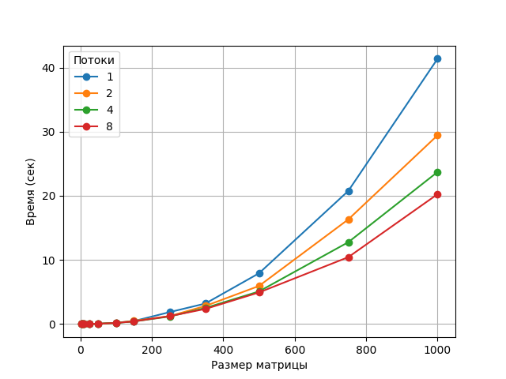

1. Целью данной работы является модификация алгоритма перемножения матриц для реализации параллельных вычислений с использованием MPI. Проводится исследование эффективности параллельного алгоритма в зависимости от количества используемых потоков.

2. Выполнение: https://github.com/den3yb/Parallel-prog/tree/lab-3

3. Экспериментальные данные демонстрируют значительное сокращение времени выполнения программы с увеличением числа рабочих потоков (см. рисунок). При этом, эффект от масштабирования количества потоков наиболее заметен при обработке матриц больших размеров.

4. Вывод: В ходе выполнения лабораторной работы разработан и исследован параллельный алгоритм перемножения матриц на основе MPI. Полученные результаты подтверждают, что применение параллельных методов существенно снижает время выполнения вычислений. Более того, эффективность параллелизации возрастает с увеличением размеров перемножаемых матриц, что свидетельствует о целесообразности использования MPI для решения задач использующих большие объемы данных.