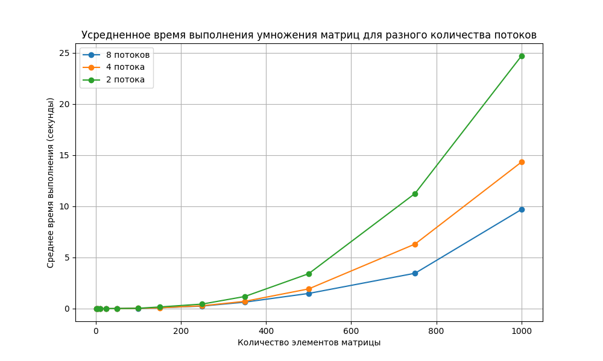

1. Задание: Переделать код из предыдущей лабараторной работы для работы с OpenMP. Исследование времени выполнения от количества потоков по среднему времени выполнения.

2. Выполнение: https://github.com/den3yb/Parallel-prog

3. Результаты экспериментов: Время выполнения программы возраст не линейно, а скорее экспоненциально вместе с увеличением объёмма матриц.

4. Вывод: В ходе выполнения лабараторной работы былы выполнено задания, собранна и проанализированна стистика о времени выполнения взависимости от размера матриц. Выявлена необходимость необходимость оптимизации кода и использования парапараллелизации вычислени.